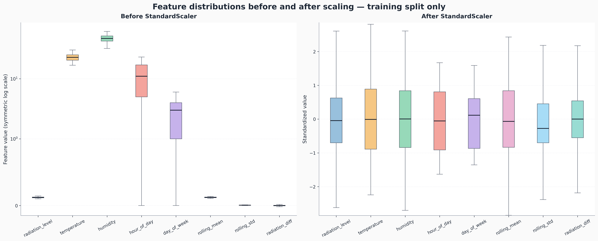
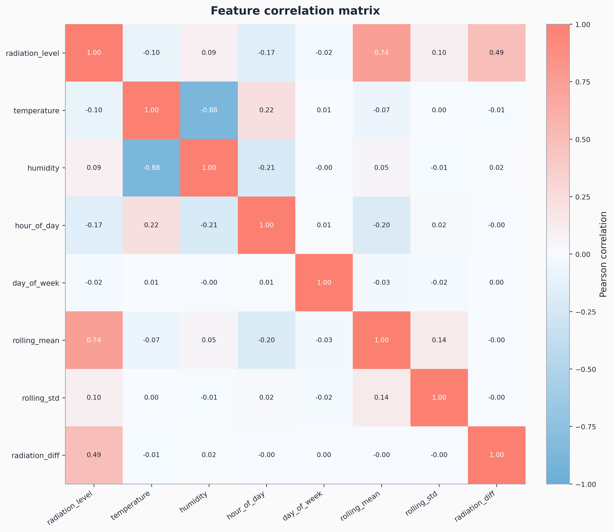

# Model Evaluation Report

Generated at: **2026-09-11 02:00:22**

This report is produced by the project script after the model-evaluation step. It summarizes the dataset, used features, trained models, calculated metrics and generated plots.

## 1. Dataset Summary

- Dataset ID: **47**
- Dataset name: **mock2.0**
- Original file: **mock2.0.csv**
- Source type: **csv**
- Current status: **evaluated**
- Uploaded at: **2026-08-26 17:04:29.512290**
- Time range: **2026-02-01 00:00:00 → 2026-02-18 08:30:00**
- Number of sensors: **4**
- Number of locations: **4**
- Average radiation level: **0.1225 μSv/h**
- Minimum radiation level: **0.0841 μSv/h**
- Maximum radiation level: **0.1625 μSv/h**

## 2. ELT Pipeline Summary

The data pipeline is organized in several steps. The original CSV values are loaded first, then cleaned, transformed into features and finally used for model training, anomaly detection and evaluation.

| Layer | Table | Row count | Purpose |
|---|---:|---:|---|
| Raw layer | raw_measurements | 10000 | Stores values loaded from the original CSV file |
| Clean layer | clean_measurements | 10000 | Stores cleaned radiation measurements |
| Feature layer | feature_measurements | 10000 | Stores features used by the ML models |
| ML results layer | anomaly_results | 140000 | Stores model predictions and anomaly scores |

## 3. Data Cleaning Summary

- Rows loaded into raw layer: **10000**
- Rows kept after cleaning: **10000**
- Rows removed during cleaning: **0**
- Invalid timestamps and invalid radiation values are removed
- Missing temperature and humidity values are kept during cleaning and are filled later using values learned only from the training data
- Empty sensor IDs are replaced with `UNKNOWN_SENSOR`
- Empty locations are replaced with `Unknown`
- Original anomaly labels are normalized when they exist in the dataset

### Missing Values After Cleaning

| column | missing_values |
| --- | --- |
| radiation_level | 0 |
| temperature | 0 |
| humidity | 0 |
| original_label | 0 |
| anomaly_type | 0 |

## 4. Feature Engineering

The models use the following input features:

| Feature | Description |
|---|---|
| radiation_level | Cleaned radiation measurement value |
| temperature | Cleaned temperature value |
| humidity | Cleaned humidity value |
| hour_of_day | Hour extracted from timestamp |
| day_of_week | Day of week extracted from timestamp |
| rolling_mean | Rolling average of radiation level per sensor |
| rolling_std | Rolling standard deviation of radiation level per sensor |
| radiation_diff | Difference from the previous radiation value per sensor |

## 5. Label Availability

- Clean rows: **10000**
- Rows with original labels: **10000**
- Original anomalies: **240**
- Original normal rows: **9760**

When labels are available, the models are evaluated on the chronological test split. When labels are missing, the system still detects anomalies, but it reports anomaly count, anomaly rate and score statistics instead of classification metrics.

## 6. Model Selection Rationale

The selected models cover the two cases that the application needs to support. Some datasets have an `is_anomaly` column, while real measurement files may not have manually checked labels.

For that reason, both unsupervised and supervised models are kept. Unsupervised models are needed for real unlabeled measurements. Supervised models are used as a controlled comparison when labels exist, because their predictions can be checked against known anomaly labels.

| Group | Models | Reason for inclusion |
|---|---|---|
| Unsupervised anomaly detection | Isolation Forest, Local Outlier Factor, One-Class SVM, DBSCAN, K-Means, Gaussian Mixture Model, PCA, HBOS, ECOD | Used when anomaly labels are not available |
| Supervised classification | Logistic Regression, Decision Tree, Random Forest, Gradient Boosting, KNN Classifier | Used when labels exist and the model can be evaluated directly |

## 7. Evaluation Methodology

The dataset is split chronologically: the first 70% of records are used for model development and the last 30% are kept as the final test set. Missing-value replacement and model scaling are fitted only on the training data.

When original labels are available, the model predictions are compared with the `is_anomaly` values. The report includes accuracy, precision, recall, F1-score, ROC-AUC, PR-AUC, FPR, FNR and confusion-matrix values. Accuracy is shown, but it is not enough on its own because the dataset contains many more normal measurements than anomalies.

Regression metrics such as MAE, MSE, RMSE and R² are not used as primary metrics in this experiment, because the goal is not to predict the next exact radiation value. The goal is to mark a measurement as normal or anomalous, or to detect unusual points when labels are missing.

For real datasets without labels, accuracy, precision, recall and F1-score are not calculated, because there is no ground-truth label. In that case, the application reports detected anomalies, anomaly rate and anomaly score statistics.

## 8. Model Evaluation Metrics

The table below contains the stored metrics for all evaluated models. For labeled and supervised evaluation, the values are calculated on the chronological test split.

| model_name | evaluation_mode | accuracy | precision_score | recall_score | f1_score | roc_auc | pr_auc | fpr | fnr | tp | tn | fp | fn | true_anomalies | total_records | total_anomalies | anomaly_rate | score_mean | score_std | score_variance | training_time_seconds | prediction_time_seconds | best_result_for |
| --- | --- | --- | --- | --- | --- | --- | --- | --- | --- | --- | --- | --- | --- | --- | --- | --- | --- | --- | --- | --- | --- | --- | --- |
| DBSCAN | labeled | 96.5700 | 0.3125 | 0.3425 | 0.3268 | 0.8445 | 0.2411 | 0.0188 | 0.6575 | 25 | 2872 | 55 | 48 | 73 | 3000 | 80 | 2.667 | 0.4533 | 0.2046 | 0.0419 | 0.4005 | 0.0196 | f1_score |
| ECOD | labeled | 96.3300 | 0.2394 | 0.2329 | 0.2361 | 0.7697 | 0.1986 | 0.0184 | 0.7671 | 17 | 2873 | 54 | 56 | 73 | 3000 | 71 | 2.367 | 13.2230 | 3.1439 | 9.8841 | 0.0822 | 0.0103 |  |
| Gaussian Mixture Model | labeled | 94.8700 | 0.2086 | 0.3973 | 0.2736 | 0.8870 | 0.2106 | 0.0376 | 0.6027 | 29 | 2817 | 110 | 44 | 73 | 3000 | 139 | 4.633 | 8.6372 | 2.3717 | 5.6250 | 0.5064 | 0.0005 | roc_auc |
| HBOS | labeled | 94.4700 | 0.2038 | 0.4384 | 0.2783 | 0.8461 | 0.2440 | 0.0427 | 0.5616 | 32 | 2802 | 125 | 41 | 73 | 3000 | 157 | 5.233 | -13.4762 | 2.9898 | 8.9389 | 1.4877 | 0.0008 |  |
| Isolation Forest | labeled | 95.8000 | 0.2476 | 0.3562 | 0.2921 | 0.8232 | 0.2026 | 0.0270 | 0.6438 | 26 | 2848 | 79 | 47 | 73 | 3000 | 105 | 3.500 | -0.0693 | 0.0331 | 0.0011 | 0.1936 | 0.0517 |  |
| K-Means | labeled | 95.1300 | 0.2336 | 0.4384 | 0.3048 | 0.7858 | 0.2313 | 0.0359 | 0.5616 | 32 | 2822 | 105 | 41 | 73 | 3000 | 137 | 4.567 | 2.3916 | 0.6949 | 0.4828 | 2.5278 | 0.0004 |  |
| Local Outlier Factor | labeled | 97.5700 | 0.5000 | 0.1644 | 0.2474 | 0.8280 | 0.1936 | 0.0041 | 0.8356 | 12 | 2915 | 12 | 61 | 73 | 3000 | 24 | 0.800 | -0.4224 | 0.1016 | 0.0103 | 0.1283 | 0.0528 | accuracy, precision_score |
| One-Class SVM | labeled | 91.3000 | 0.1179 | 0.3973 | 0.1818 | 0.7536 | 0.2048 | 0.0741 | 0.6027 | 29 | 2710 | 217 | 44 | 73 | 3000 | 246 | 8.200 | -5.1699 | 3.9672 | 15.7386 | 0.0756 | 0.0639 |  |
| PCA | labeled | 92.1000 | 0.1273 | 0.3836 | 0.1911 | 0.8086 | 0.1606 | 0.0656 | 0.6164 | 28 | 2735 | 192 | 45 | 73 | 3000 | 220 | 7.333 | 0.0300 | 0.0383 | 0.0015 | 0.0079 | 0.0002 | prediction_time_seconds |
| Decision Tree | supervised | 87.9700 | 0.1150 | 0.5890 | 0.1924 | 0.7589 | 0.2929 | 0.1131 | 0.4110 | 43 | 2596 | 331 | 30 | 73 | 3000 | 374 | 12.467 | 0.2357 | 0.2291 | 0.0525 | 0.0164 | 0.0011 | recall_score, fnr |
| Gradient Boosting | supervised | 97.5700 | 0.5000 | 0.1233 | 0.1978 | 0.8261 | 0.2807 | 0.0031 | 0.8767 | 9 | 2918 | 9 | 64 | 73 | 3000 | 18 | 0.600 | 0.0175 | 0.0782 | 0.0061 | 0.4997 | 0.0039 | accuracy, precision_score |
| KNN Classifier | supervised | 97.5300 | 0.4615 | 0.0822 | 0.1395 | 0.7598 | 0.3037 | 0.0024 | 0.9178 | 6 | 2920 | 7 | 67 | 73 | 3000 | 13 | 0.433 | 0.0145 | 0.0635 | 0.0040 | 0.0022 | 0.0848 | pr_auc, fpr, training_time_seconds |
| Logistic Regression | supervised | 79.8000 | 0.0681 | 0.5753 | 0.1217 | 0.7588 | 0.1530 | 0.1964 | 0.4247 | 42 | 2352 | 575 | 31 | 73 | 3000 | 617 | 20.567 | 0.3289 | 0.1938 | 0.0376 | 0.0143 | 0.0003 |  |
| Random Forest | supervised | 96.2000 | 0.2842 | 0.3699 | 0.3214 | 0.8416 | 0.2004 | 0.0232 | 0.6301 | 27 | 2859 | 68 | 46 | 73 | 3000 | 95 | 3.167 | 0.1630 | 0.1424 | 0.0203 | 0.2910 | 0.0560 |  |

Full metrics CSV: `../tables/model_metrics_full.csv`

Best-marked metrics CSV: `../tables/model_metrics_best_marked.csv`

## 9. Best Results by Metric

If more than one model has the same best value for a metric, all of them are listed in the `best_model` column.

| metric | best_model | value | criterion |
| --- | --- | --- | --- |
| accuracy | Local Outlier Factor, Gradient Boosting | 97.5700 | higher is better |
| precision_score | Local Outlier Factor, Gradient Boosting | 0.5000 | higher is better |
| recall_score | Decision Tree | 0.5890 | higher is better |
| f1_score | DBSCAN | 0.3268 | higher is better |
| roc_auc | Gaussian Mixture Model | 0.8870 | higher is better |
| pr_auc | KNN Classifier | 0.3037 | higher is better |
| fpr | KNN Classifier | 0.0024 | lower is better |
| fnr | Decision Tree | 0.4110 | lower is better |
| training_time_seconds | KNN Classifier | 0.0022 | lower is better |
| prediction_time_seconds | PCA | 0.0002 | lower is better |

## 10. Result Interpretation

Accuracy is shown in the table, but I did not use it as the only criterion. The dataset is imbalanced, because normal measurements are much more common than anomalies. For that reason, precision, recall, F1-score, PR-AUC and the confusion matrix are more useful for comparing the models.

Precision–Recall curves are interpreted together with the positive-class baseline. When anomalies are rare, the PR curve can look irregular and can drop quickly as recall increases. This is not a plotting error: it shows that a model can detect more anomalies only by accepting more false-positive alarms, which lowers precision.

Among the unsupervised models, DBSCAN had the highest F1-score on the labeled test split, with F1-score 0.327. This indicates the best balance between precision and recall among the currently available unsupervised results.
Isolation Forest achieved F1-score 0.292, ROC-AUC 0.823 and PR-AUC 0.203. It is relevant for the practical version of the application because it can be trained without manually prepared anomaly labels.
HBOS reached recall 0.438 and precision 0.204. A higher recall means that more true anomalies were detected, while lower precision indicates a larger number of false alarms.
One-Class SVM reached recall 0.397 and precision 0.118. This result shows the trade-off between detecting more anomalies and producing additional false positive predictions.

### DBSCAN baseline note

DBSCAN was kept as a clustering-based baseline, not as the main model for the future real-time version. Standard DBSCAN does not train a reusable classifier with a normal `predict` method for new measurements. It groups the currently loaded points and marks low-density points as noise, so the result depends strongly on the selected dataset and parameters.
In this run, DBSCAN achieved F1-score 0.327 and recall 0.343. It is useful as a clustering baseline, but it is less suitable for direct application to future streaming measurements than models with a standard train-and-predict workflow.

## 11. Generated Figures

The figures support the metric table with feature diagnostics, model comparisons, confusion matrices and ROC and Precision-Recall curves. Classification curves use anomaly scores stored by the main model pipeline on the chronological test split.

### Feature Scaling Diagnostics

### Classification Metrics Bar

### Auc Metrics Bar

### Training Time Bar

### Prediction Time Bar

### Feature Correlation Heatmap

### Confusion Matrices Supervised

### Confusion Matrices Unsupervised

### Roc Curves

### Precision Recall Curves

## 12. Feature Correlation Matrix

| feature | radiation_level | temperature | humidity | hour_of_day | day_of_week | rolling_mean | rolling_std | radiation_diff |
| --- | --- | --- | --- | --- | --- | --- | --- | --- |
| radiation_level | 1.0000 | -0.0990 | 0.0870 | -0.1660 | -0.0190 | 0.7360 | 0.0980 | 0.4880 |
| temperature | -0.0990 | 1.0000 | -0.8810 | 0.2230 | 0.0070 | -0.0690 | 0.0020 | -0.0110 |
| humidity | 0.0870 | -0.8810 | 1.0000 | -0.2130 | -0.0020 | 0.0520 | -0.0100 | 0.0150 |
| hour_of_day | -0.1660 | 0.2230 | -0.2130 | 1.0000 | 0.0090 | -0.2010 | 0.0230 | -0.0010 |
| day_of_week | -0.0190 | 0.0070 | -0.0020 | 0.0090 | 1.0000 | -0.0260 | -0.0200 | 0.0000 |
| rolling_mean | 0.7360 | -0.0690 | 0.0520 | -0.2010 | -0.0260 | 1.0000 | 0.1360 | -0.0030 |
| rolling_std | 0.0980 | 0.0020 | -0.0100 | 0.0230 | -0.0200 | 0.1360 | 1.0000 | -0.0020 |
| radiation_diff | 0.4880 | -0.0110 | 0.0150 | -0.0010 | 0.0000 | -0.0030 | -0.0020 | 1.0000 |

## 13. Conclusion

The evaluation shows that the system can train and compare traditional machine-learning models for radiation anomaly detection. The strongest supervised results were obtained on the labeled mock dataset, where anomaly patterns are clearly defined. These results are useful for checking the pipeline, but they should not be treated as guaranteed performance on real radiation-monitoring data.

For the practical version of the application, the unsupervised workflow is especially important. It allows the system to work with real datasets that do not contain an `is_anomaly` column. In that case, the model creates the `predicted_anomaly` result, and the application reports anomaly counts and score statistics instead of supervised metrics.

The comparison table, best-result markers and generated figures can be used later in the thesis discussion and in the Model Testing view of the application.
